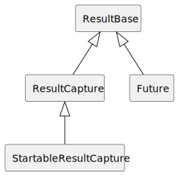

Detailed documentation
======================

.. module:: aioresult

.. _base:

Base class
----------

The two main classes in aioresult, :class:`ResultCapture` and :class:`Future`, have almost
identical interfaces: they both allow waiting for and retrieving a value. That interface is
contained in the base class, :class:`ResultBase`:

.. note::
    If you are returning a :class:`ResultCapture` or :class:`Future` from a function then you may
    wish to document the return type as just :class:`ResultBase` because that has all the methods
    relevant for retrieving a result. For example, :meth:`StartableResultCapture.start_result()`
    does this.

.. autoclass:: ResultBase
    :members:

``ResultBase`` makes uses of the following exception class (along with :class:`TaskFailedException`,
which is described below).

.. autoexception:: TaskNotDoneException
    :show-inheritance:
    :members:

.. _exception:

Exception handling and design rationale
---------------------------------------

A key design decision about the ``ResultCapture`` class is that **exceptions are allowed to
escape out of the task** so they propagate into the task's nursery.

Some related libraries, such as `Outcome <https://outcome.readthedocs.io/en/latest/>`__ and
`trio-future <https://github.com/danielhfrank/trio-future>`__, consume any exception thrown by the
task and reraise it when the result is retrieved. This gives the calling code more control: it can
choose at what point to retrieve the result, and therefore at what point the exception is thrown.
However, it has some disadvantages:

* The calling code must ensure the exception is always retrieved, otherwise the exception is
  silently lost. That would be particularly problematic if it is an injected exception such as
  :class:`trio.Cancelled` or :class:`KeyboardInterrupt`. This can be difficult to arrange reliably,
  especially if multiple tasks like this raise exceptions. The whole point of `structured
  concurrency
  <https://vorpus.org/blog/notes-on-structured-concurrency-or-go-statement-considered-harmful/>`__
  was meant to be that you don't have to worry about this problem!
* For many exceptions, it does not make sense to be raised more than once, so the calling code must
  be careful to retrieve the result only once. For example, Outcome `raises an error
  <https://outcome.readthedocs.io/en/latest/api.html#outcome.AlreadyUsedError>`__ if it is
  unwrapped more than once.
* The calling code must be careful about whether the exception still makes sense in the context in
  which the result is retrieved. For example, if the exception is a :class:`trio.Cancelled` then
  its corresponding nursery must still be live.

If your goal is simply to store a return value from an async function then you probably do not want
this control anyway: you just want any exception to be raised in the nursery where the function is
running. aioresult does this, which avoids the above complexities: the exception always makes sense
in its context (because it's in the original place it was raised) and you are free to retrieve the
result once, many times, or not at all.

If the task throws an exception then any calls to :meth:`ResultBase.result()` will also throw an
exception, but a :class:`TaskFailedException` is thrown instead of the original:

.. autoexception:: TaskFailedException
    :show-inheritance:
    :members:

.. _capture:

Capturing a result
------------------

The main class of aioresult is the :class:`ResultCapture` class. If you are directly awaiting a task
then there is no need to use this class – you can just use the return value::

    result1 = await foo(1)
    result2 = await foo(2)
    print("results:", result1, result2)

If you want to run your tasks in parallel then you would typically use a nursery, but then it's
harder to get hold of the results::

    async with trio.open_nursery() as n:
        n.start_soon(foo, 1)
        n.start_soon(foo, 2)
    # At this point the tasks have completed, but the results are lost
    print("results: ??")

To get access to the results, the usual advice is to either modify the routines so that they
store their result somewhere rather than returning it or to create a little wrapper function
that stores the return value of the function you actually care about. :class:`ResultCapture` is a
simple helper to do this::

    async with trio.open_nursery() as n:
        result1 = ResultCapture.start_soon(n, foo, 1)
        result2 = ResultCapture.start_soon(n, foo, 2)
    # At this point the tasks have completed, and results are stashed in ResultCapture objects
    print("results", result1.result(), result2.result())

You can get very similar effect to :func:`asyncio.gather()` by using a nursery and an array
of :class:`ResultCapture` objects::

    async with trio.open_nursery() as n:
        results = [ResultCapture.start_soon(n, foo, i) for i in range(10)]
    print("results:", *[r.result() for r in results])

Unlike asyncio's gather, you benefit from the safer behaviour of Trio nurseries if one of the tasks
throws an exception. :class:`ResultCapture` is also more flexible because you don't have to use a
list, for example you could use a dictionary::

    async with trio.open_nursery() as n:
        results = {i: ResultCapture.start_soon(n, foo, i) for i in range(10)}
    print("results:", *[f"{i} -> {r.result()}," for i, r in results.items()])

Any exception thrown by the task will propagate out as usual, typically to the enclosing
nursery. See `Exception handling and design rationale`_ for details.

.. autoclass:: ResultCapture
    :members:
    :show-inheritance:

.. _startable:

Wait for a task to finish starting
----------------------------------

Trio and anyio support waiting until a task has finished starting with :meth:`trio.Nursery.start()`
and :meth:`anyio.abc.TaskGroup.start()`. For example, a routine that supports this could look like
this::

    async def task_with_start_result(i, task_status=trio.TASK_STATUS_IGNORED):
        await trio.sleep(i)
        task_status.started(i * 2)
        await trio.sleep(i)
        return i * 3

It could be used as follows::

    async with trio.open_nursery() as n:
        start_result = await n.start(task_with_start_result, 1)
        # At this point task is running in background
    # Another 1 second passes before we get here

For example, :func:`trio.serve_tcp()` signals that it has finished starting when the port is open
for listening, and it returns which port number  it is listenting on (which is useful because the
port can be assigned automatically).

The peculiar-looking default value of ``trio.TASK_STATUS_IGNORED`` is there so that the function can
be called without using it as part of this special dance. In particular, this means you can use
these functions with :class:`ResultCapture` as usual::

    async with trio.open_nursery() as n:
        rc = ResultCapture.start_soon(n, task_with_start_result, 1)
    print("Final result:", rc.result())

However, doing this loses the ability to wait until the task has started (but not completed) and
fetch the start return value. :class:`StartableResultCapture` is a derived class of
:class:`ResultCapture` that allows capturing both the start value and final value::

    async with trio.open_nursery() as n:
        rc = StartableResultCapture.start_soon(n, task_with_start_result, 1)
        await rc.start_result().wait_done()
        print("Start result:", rc.start_result().result())
    print("Final result:", rc.result())

It is also possible to pass in another nursery where the task will be started. This is useful for
waiting until multiple tasks have all finished their startup code::

    async with trio.open_nursery as run_nursery:
        async with trio.open_nursery as start_nursery:
            rcs = [
                StartableResultCapture.start_soon(
                    run_nursery, task_with_start_result, i, start_nursery=start_nursery
                ) for i in range(10)
            ]
        print("Now all tasks have started:", *[rc.start_result().result() for rc in rcs])
    print("Overall results:", *[rc.result() for rc in rcs])

.. autoclass:: StartableResultCapture
    :show-inheritance:
    :members:

Future
------

The :class:`Future` class allows storing the result of an operation, either a return value or a
raised exception. It differs from :class:`ResultCapture` in that you manually specify the result by
calling either :meth:`Future.set_result()` or :meth:`Future.set_exception()` rather than the result
automatically being captured from some async function.

This is often useful when you are implementing an API in a library where requests can be sent to
some remote server, but multiple requests can be outstanding at a time so the result is set in some
separate async routine::

    # Public function in the API: Send the request over some connection
    def start_request(request_payload) -> ResultBase:
        request_id = connection.send_request(request_payload)
        result = aioresult.Future()
        outstanding_requests[request_id] = result
        return result

    # Hidden function in the API: In a separate task, wait for responses to any request
    async def get_responses():
        while True:
            request_id, response = await connection.get_next_response()
            outstanding_requests[request_id].set_result(response)
            del outstanding_requests[request_id]

    # Caller code: Use the API and returned Future object
    async def make_request():
        f = start_request(my_request)
        await f.wait_done()
        print("result:", f.result())

If you need to wait for several futures to finish, in a similar way to :func:`asyncio.gather()`,
then use a nursery and await :meth:`ResultBase.wait_done()` for them all::

    results = [start_request(i) for i in range(10)]
    async with trio.open_nursery() as n:
        for f in some_futures:
            n.start_soon(f.wait_done)
    print("results:", *[f.result() for f in results

The above code also warks with :class:`ResultCapture` but in that case is usually a mistake – just
pass the nursery to the :meth:`ResultCapture.start_soon()` function.

.. autoclass:: Future
    :show-inheritance:
    :members:

:class:`Future` makes use of the following exception class:

.. autoexception:: FutureSetAgainException
    :show-inheritance:
    :members:

